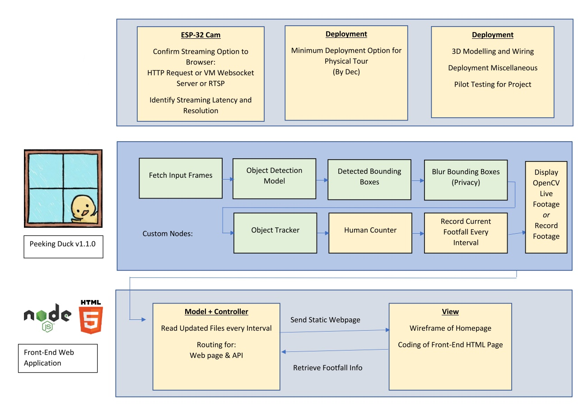

# Human Entrance Counter with PeekingDuck

## Project Overview

The project utilizes [PeekingDuck](https://github.com/aimakerspace/PeekingDuck) with custom nodes for human detection and tracking along with [Express.js](https://expressjs.com/) as backend controller.




## Software Required:
- [Anaconda](https://www.anaconda.com/products/individual)
- [git](https://git-scm.com/downloads)
- [GitHub Desktop (For those that are unfamiliar with CLI)](https://desktop.github.com/)
- [VS Code](https://code.visualstudio.com/)

## Getting Started
1. Clone the Repository with 
    - Git CLI
        ```
        git clone https://github.com/Amirrahman19/NationalAIStudentChallenge.git
        ```
    - GitHub Desktop App
        1. Add repository
        2. Clone repository
        3. Input the URL `NationalAIStudentChallenge`
2. Setting Up Conda Python Environment
    ```bash
    conda create --name human-entrance python=3.8
    conda activate human-entrance
    pip install peekingduck
    ```
3. Open the `./human_counter` directory in your terminal by running
    ```bash
    cd human_counter
    ```
4. Run peekingduck through the terminal:
    ```bash
    peekingduck run
    ```
5. Stop Peekingduck by pressing `ctrl+c` in the terminal or `q` on the peekingduck window.

## Backend API Endpoints and Formatting

| column      | format              | data type       |example          |
| ---         | ---                 | ---             | ---             |
| time        | YYYYMMDDhhmmss      | string          |20211114102300   |
| footfall    | int                 | integer         |1                |
| location    | locationname        | string          |fc3              |

### Get Footfall History of a Location

GET `/history/:location/:startTime/:endTime`
- Inputs: 
    - locationname(`string`)
    - startTime(`string in YYYYMMDDhhmmss`)
    - endTime(`string in YYYYMMDDhhmmss`)
- Outputs: 
    - json array of records with each records having:
        - footfallid (`int`)
        - time (`string in YYYYMMDDhhmmss`)
        - curentfootfall (`int`)
        - location (`string`)
        - netfootfall (`int`)
- Example:
    ```get /history/fc1/20211111024000/20211114130000```

    output:
    ```
    [
        {
            "footfallid": 34,
            "time": "20211114101000",
            "currentfootfall": 20,
            "location": "fc1",
            "netfootfall": 20
        },
        {
            "footfallid": 35,
            "time": "20211114111000",
            "currentfootfall": 40,
            "location": "fc1",
            "netfootfall": 20
        }
    ]
    ```
    > currentfootfall = total footfall(all added together), netfootfall = footfall recorded at time of record

### Get Latest Footfall of a Location
GET `/latest/:location`
- Inputs: 
    - locationname (`string`)
- Output: 
    - json object with 1 record
        - footfallid (`int`)
        - time (`string in YYYYMMDDhhmmss`)
        - curentfootfall (`int`)
        - location (`string`)
- Example:
    ```get /latest/fc6```

    output:
    ```
    {
        "footfallid": 33,
        "time": "20211111024500",
        "currentfootfall": 0,
        "location": "fc6"
    }
    ```
    
### Get Latest Footfall of a Location within a set number of hours
GET `/latest/:location/:noHours`
- Inputs: 
    - locationname (`string`)
    - noHours (`string`)
- Output: 
    - json object with 1 record
        - footfallid (`int`)
        - time (`string in YYYYMMDDhhmmss`)
        - curentfootfall (`int`)
        - location (`string`)
- Example:
    ```get /latest/fc6/1```

    output:
    ```
    {
        "footfallid": 33,
        "time": "20211111024500",
        "currentfootfall": 0,
        "location": "fc6"
    }
    ```
    
### Record Footfall History
POST `/history`
- Inputs: 
    - locationname(string)
    - startTime(string in YYYYMMDDhhmmss)
    - netfootfall (int)
- Output: 
    - empty array, []
- Example:
    ```post /history```

    _body_:
    ```
    time:20211114121500
    netfootfall:30
    location:fc1
    ```
    output: []
### Dockerize Front end
cd front_end

docker build -t front_end .

docker run -p 5000:5000 front_end

### Dockerize Back End
cd back_end

docker build . -t back_end

docker run -p 49160:8080 -d back_end
